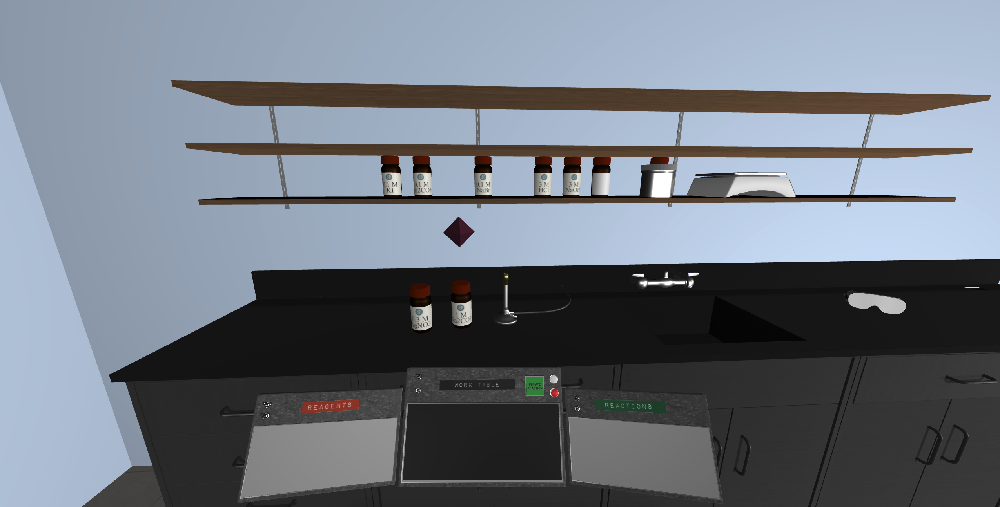

# PRISM Demo



An application that demos how Apollo and Prisma GraphQL working together in vanilla javascript.

## Install PROD

```bash
git clone https://github.com/EberlyODL/chemical-reaction-lab.git
cd chemical-reaction-lab
# create .env file and add your own config
cp .env.example .env
# start production
make start-prod
```

Visit http://<HOST_URL>


## Install Dev

```bash
git clone https://github.com/EberlyODL/chemical-reaction-lab.git
cd chemical-reaction-lab
# create .env file and add your own config
cp .env.example .env
# start dev
make start-dev
```

Visit: [http://localhost:1234](http://localhost:1234)


## Commands

### Start-prod

Deploy this on your production box.  Exposes port 80.

```
make start-prod
```

### Start-dev

To get started working locally.  Exposes port 1234 which is a parcel live reload server and hot module replacement server.

```
make start-dev
```

Alternatively, you can run the backend in Docker and compile the frontend locally.  This allows you to start and stop the node server more requently. The parcel server also runs slightly faster.

```
make start-backend
npm run frontend:parcel
```

### Build-frontend

Simulate a parcel build of the frontend.  This will place the built files in `frontend/dist`.  This is called automatically in `make start-prod`.

```
make build-frontend
```

### prisma-update

Regenerates the graphql prisma server and prisma client located in `backend/generated/prisma-client`.  This need be run after every change to the `backend/datamodel.prisma` file. This is called automatically in `make start-prod` and `make start-dev`.

```
make prisma-update
```

### prisma-update-force

If you run prisma update and you get warning messages saying `You already have nodes for this relation. This change will result in data loss` then you probably need to force a prisma update.  THIS IS DESTRUCTIVE. THIS WILL CAUSE DATA LOSS. You probably shouldn't do this in production.

```
make prisma-update-force
```